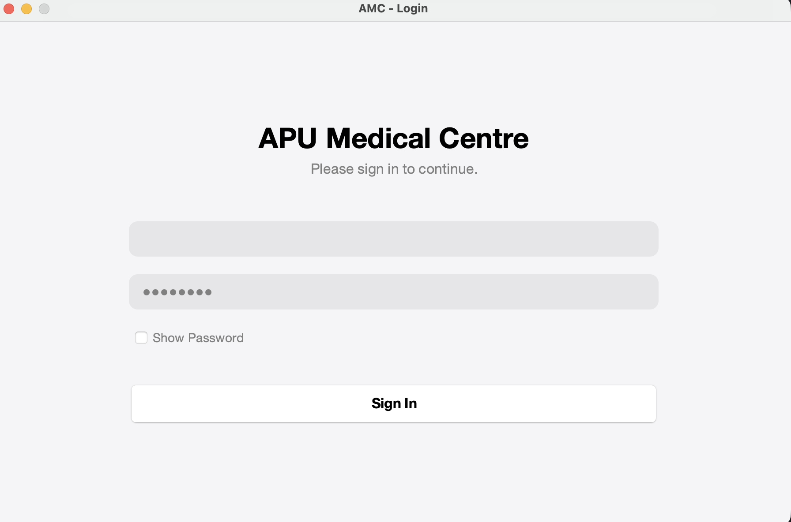
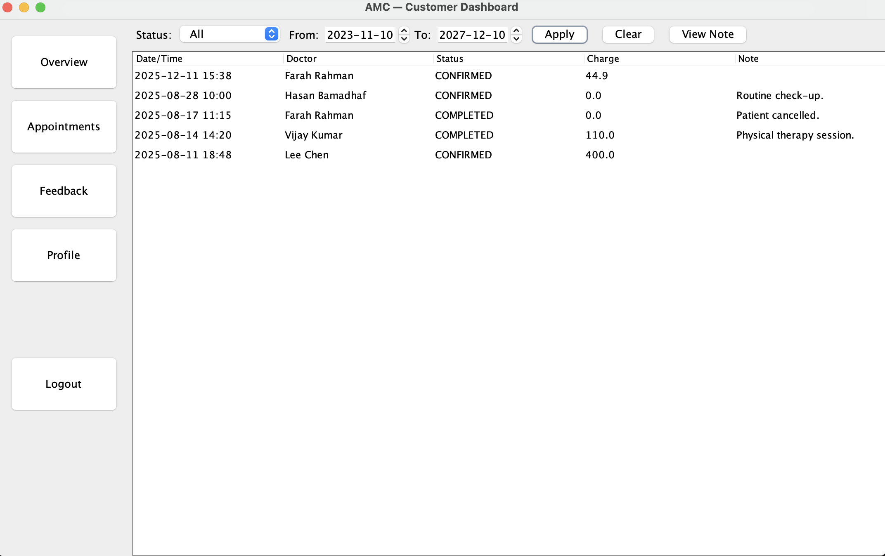
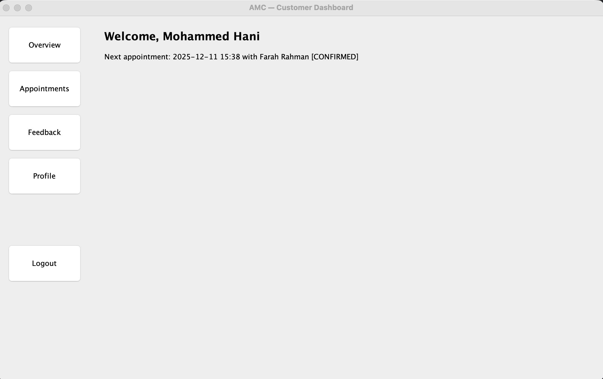
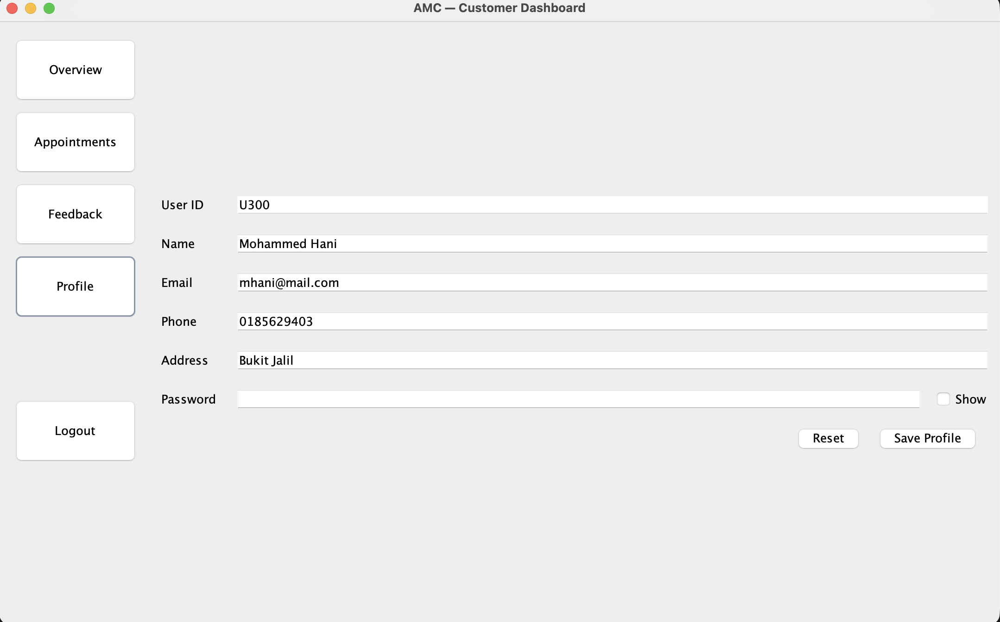
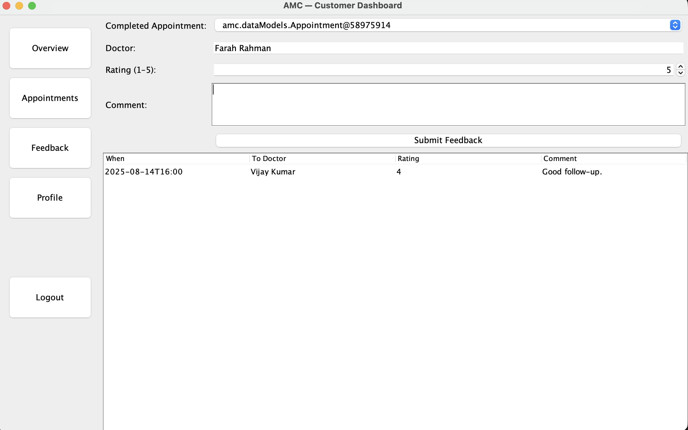

<h1 align="center">Medical Center Management System</h1>

  A Java-based desktop application designed to manage appointments, patient records, profiles, and feedback within a medical center environment.

---

## Overview

The **Medical Center Management System** is a Java application built to streamline clinic workflows by centralizing appointments, patient information, doctor schedules, user profiles, and feedback.  

It provides a clean UI and user-friendly experience suitable for medical staff and administrative operations.

---

## Technologies Used

- **Java (JDK 8+)**
- **OOP principles**
- **File Storage** 

---

## Features

- **Login & Welcome Page**
- **Appointment Management**
- **Dashboard / Home Page**
- **User Profile Management**
- **Feedback Submission & Management**
-  **Organized UI structure**
-  **Smooth navigation between pages**

---

## Running the Project

### 1. Compile the Java source code

javac -d bin src/*.java

2. Run the application

java -cp bin Main

Replace Main with your actual main class name.

### Screenshots

#### 1. Welcome / Login Page (All Modules)

<pr>

  

#### 2. Appointments Page (Customer Module)

<pr>

  

#### 3. Home Page (Customer Module)

<pr>

  

#### 4. Profile Page (All Modules)

<pr>

  

 #### 5. Feedback Page (Customer Module)
 
<pr>

  

 
## Contributors

| Name               | Role                 |
|--------------------|----------------------|
| Mohammed Hani      | Customer Module      |
| Hasan Abdulwahid   | Doctor Module        |
| Omar Feras         | Manager Module       |
| Yosuf Aymen        | Staff Module |

